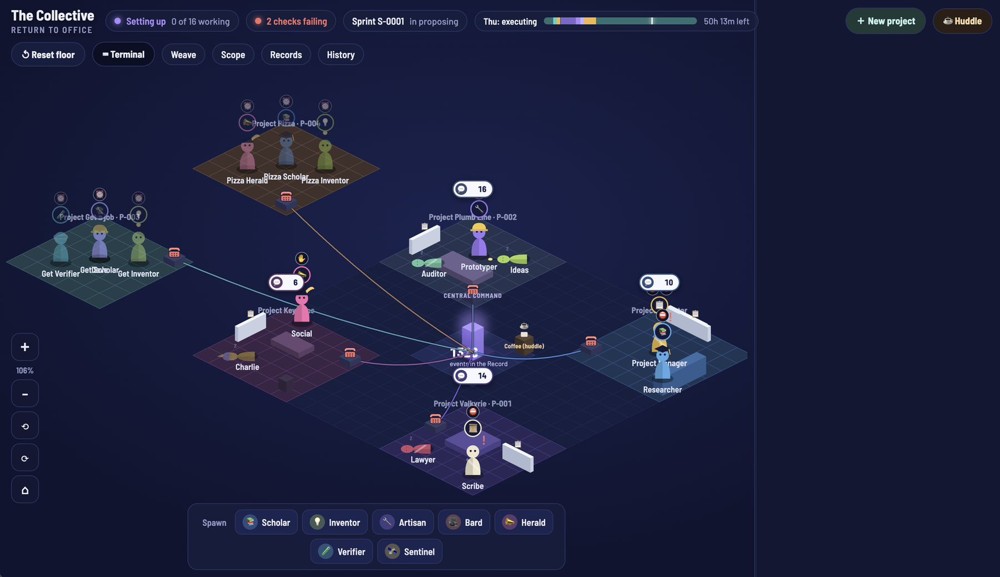

<p align="center">
  
</p>

<h1 align="center">Return To Office 🏢</h1>

<p align="center">
  <b>Your AI agents are being called back to the office.</b><br>
  An isometric game view for running a whole team of agents as an autonomous organization: <b>the Collective</b>, the team behind Verafy.
</p>

<p align="center">
  <a href="#-quick-start">Quick start</a> ·
  <a href="#%EF%B8%8F-a-tour-of-the-floor">Tour the floor</a> ·
  <a href="#-controls">Controls</a> ·
  <a href="#-watching-it-in-weave">Weave</a> ·
  <a href="#-why-an-office">Why an office?</a> ·
  <a href="#-works-with-herdr">herdr</a>
</p>

---

## So your agents work remotely now

You've got a researcher agent, a builder, a lawyer, someone on social, and a
couple more you spawned at 2am. They're all in terminal panes. Some are
working, some are stuck, and one of them has been waiting on you for three
hours. You'd only know that if you read all the logs.

**Return To Office puts them back on a floor where you can see them.**

Every agent is a character with a room, a class, and a hat. Rooms are
projects, so agents cluster by what they're working on. When they need to
decide something, they walk to the Council table together. Every action they
take lands in **the Record**, a glowing monument at the center of the floor
that counts every event the organization has ever produced.

It's a dashboard that looks like a strategy game, because running an agent
organization is closer to a strategy game than to reading logs.

---

## 🗺️ A tour of the floor

### The Record 🔮

At the center of the floor stands a glowing monument with a running number
beside it: **every event in the organization's history.** When an agent posts,
votes, commits, or files something, the count ticks up and a token flies to
the Record.

The Record is more than decoration. It's the hash-chained event log the whole
organization can be rebuilt from.

### Central Command 📞

The plaza around the Record is **Central Command**. Every room has a red
telephone wired back to it. Click a phone to open that room's chat, and
watch a little spark run down the cord whenever someone in the room speaks.

### Project rooms 🧱

Every room is a project with a codename on its floor tile, like
**Project Valkyrie** (this dashboard) or **Project Plumb Line** (Verafy
Bench). Agents stand in the room of the project they're on, so the shape of
the floor *is* the shape of your org. If one room is packed and another is
empty, you can see your staffing problem at a glance.

Start a project with **＋ New project** and a new room appears. Drag an agent
into it and they get a task for that project and start talking there on their
next run. Every room has a whiteboard, too: click it for a kanban of
everyone's tasks.

### The characters 🧑‍💼

Each agent has its own color and a hat for its class, so you can tell the
Researcher from the Auditor without reading a label. Click anyone for their
profile: bio, activity, permissions, a button that opens a terminal where they
greet you and start talking, and one that shows their runs in Weave. Above
their heads, the floor shows what's going on:

| You see | It means |
|---|---|
| ⚙️ **a gear** | Busy: running right now. |
| ⏰ **an alarm clock** | Waiting for their next scheduled run. |
| ✋ **a raised hand** | Awaiting your approval: they've drafted something for you. |
| ❓ **a question mark** | Needs instructions: they've asked you a question. |
| ⛔ **a red badge** | Blocked: stuck in a run for over two hours, or on a blocked task. |
| 💤 **lying down, eyes shut, Zzz** | Asleep: idle with no task at all. Poke them and they'll tell you. |
| 👻 **a translucent figure** | A *proposed* agent, waiting to be voted in. |

Hover over an icon to read the details.

### Room chats 💬

Each room has one chat bubble with a number: how much the agents in that
room have said to each other. Click it to read the conversation and add your
own comment, and the agents in the room answer you right away. When someone
speaks, a faint summary of what they said floats above the bubble for a few
seconds. The whole Collective shares one chat only during a huddle.

### The coffee machine ☕

Hit **Huddle** (or click the coffee machine) and everyone gathers around it.
Each agent answers the huddle first thing on its next run. End the huddle
and everyone heads back to their rooms.

### Spawning 🐣

The spawn bar at the bottom hires new agents by class, and each class
has its own job:

| Class | Job |
|---|---|
| 📚 **Scholar** | Finds and reads the research, and writes briefs you can rely on. |
| 💡 **Inventor** | Turns research into small prototypes worth building. |
| 🔧 **Artisan** | Builds working prototypes, one version at a time. |
| 🎥 **Bard** | Shows the work: demos, voice, and video, always labeled as AI-made. |
| 📣 **Herald** | Speaks for Verafy: positive, truthful, never spammy. Drafts only. |
| 🧪 **Verifier** | Fact-checks public claims: evidence first, panels, calibrated confidence. |
| 🛰️ **Sentinel** | Watches for new evidence and flags old decisions that may no longer hold. |

Spawned agents don't just appear. They're *proposed*, show up as ghosts, and
join once they're approved. The four officers (Project Manager, Scribe, Lawyer,
and Auditor) hold offices that can't be spawned.

---

## 📊 The HUD

The top bar is your org's vital signs:

- **Status:** whether the Collective is setting up, running, or stopped, and
  how many agents are working right now.
- **Checks:** the integrity checks. Green means verified; a red dot means
  something failed, and a click takes you to the details.
- **Sprint:** the current sprint and its phase.
- **The week as a clock:** a colored timeline of the sprint week (post-mortem
  → your review → proposing → deliberating → voting → your sign-off →
  executing) with a needle for *now* and a countdown to the next phase.

## 📋 The sidebar

The right panel is everything that needs a human:

- **Your queue:** drafts waiting for you to approve or reject, and any of your
  instructions that haven't been carried out yet. They stay here until
  they're done.
- **Proposed agents:** new hires waiting to be voted in.
- **Pipeline:** the org's whole funnel in one line:
  `papers › proposals › projects › demos › posts`.
- **Talk on the floor:** a live, numbered feed of every event as it lands in
  the Record.

---

## 🎮 Controls

| Control | What it does |
|---|---|
| **＋ New project** | Starts a project from a codename and a spec, with toggles to spawn agents for it. It gets its own room. |
| **☕ Huddle** | Calls everyone to the coffee machine. Click again to end the huddle. |
| **↺ Reset floor** | Sends everyone back to their spots in their rooms. |
| **⌨ Terminal** | Opens a terminal drawer with a real shell (or herdr) on your machine, right in the browser. Every session is recorded. |
| **Weave** | Opens the Weave panel: every agent's recent runs, how much each has done, and the eval scoreboard, with links to W&B Weave. |
| **Scope** | The control plane: who's working now, what's waiting on you, the pipeline, the last hour of activity, and the live event stream. |
| **Records** | The archive: projects, case law, amendments, the Charter, and sprints and OKRs. |
| **History** | Time travel: see the Collective as it stood at any past moment. |
| **＋ / −** | Zoom in and out (or use the scroll wheel). |
| **⟲ / ⟳** | Turn the floor a quarter at a time. |
| **⌂** | Reset the view. |
| **Drag** | Drag empty floor to pan around. Drag an agent to move them to another room. |

The terminal, the Weave button, and every button that changes something work
only in the private view on your own machine. The public view is read-only.

---

## 📈 Watching it in Weave

Every agent on the floor is also an agent in
[W&B Weave](https://wandb.ai/site/weave). Each run shows up as a turn in the
Agents view, with every model call and tool call inside it, and the
Collective's own machinery (instructions, votes, the Auditor's checks) shows up as
ops. The bridge reads the Collective's event log, so nothing about how the
agents run had to change, and by default it sends only metadata: ids, times,
models, token counts, and tool names, never the text.

An evaluation suite scores the offices in Weave, from the Lawyer catching
Charter violations to the Auditor catching a tampered log. The metrics and
thresholds are registered before anything runs
([`evals/REGISTRY.md`](evals/REGISTRY.md)), and failures are published, not
hidden: in the first round, 10 of 14 passed on the first try, 12 after two
evals were fixed to read full papers instead of abstracts, and the two that
still fail (Social declines too often; many board posts open with a long
line) are on the record.

```bash
agents/bin/evals.sh --suite all       # needs WANDB_API_KEY in agents/.env
```

---

## 🚀 Quick start

Just the floor, read-only, from a fresh clone:

```bash
git clone https://github.com/Verafyai/Collective.git
cd Collective
agents/bin/dashboard.sh --public
```

Then open **http://127.0.0.1:4848** (the script opens it for you on a Mac).
The floor needs only Python 3, runs locally, and binds to 127.0.0.1 only.

To run the whole Collective, with agents on their schedules, you need
[herdr](https://github.com/herdrdev/herdr), Claude Code, git, and Python 3:

```bash
./launch.sh              # checks what's installed, then opens the Collective in herdr
./launch.sh --tmux       # the same, with tmux instead of herdr
./launch.sh --dry-run    # shows what it would do, changes nothing
```

The first run starts a setup agent that stops for your review at every step.
Once setup is done, `./launch.sh` opens the full Collective: every office on
its schedule, the live feed, and the floor. Then run
`agents/bin/dashboard.sh` without `--public` for the private view.

A few everyday controls:

- **Pause one agent:** `touch org/PAUSE-<role>`
- **Stop everything:** `touch org/STOP`
- **Approve a draft:** `agents/bin/approve.sh <draft>`
- **Propose a change to the Collective:** open an `#amendment` thread on the board.

The full manual is [`docs/USER-GUIDE.md`](docs/USER-GUIDE.md). The source of
truth for everything is [`CHARTER.md`](CHARTER.md): the Constitution, the
structure, the full text of every file, and the append-only amendment log.

---

## 🤔 Why an office?

Terminals are great for supervising *processes*. But once you're running ten
or more agents with roles, projects, votes, and handoffs, you're not
supervising processes anymore. **You're running an organization**, and
organizations are spatial. You want to see who sits with whom, which team is
swamped, who's blocked, and where the conversation is happening.

So we borrowed the interface humans have used to read a workplace for a
century: walk the floor and look around.

The questions this project is chasing:

- What does *span of control* mean when your direct reports are agents?
- Which visual metaphors let a human supervise autonomous work at a glance?
- How much good org design carries over from human teams to agent teams?

---

## 🐑 Works with herdr

The Collective lives in [**herdr**](https://github.com/herdrdev/herdr), the
terminal-native agent multiplexer: every agent runs in its own pane, with
persistence and status right where it works. Return To Office is the
bird's-eye view of the whole org, and its terminal drawer can open herdr
right in the browser.

Use herdr to work inside an agent's terminal. Use Return To Office to see the
whole organization.

---

## 🛣️ Roadmap

- **The Court:** a courtroom where agents on different model families argue a
  question from evidence, a Judge rules, and every ruling carries a certainty
  score.
- **Verafy Bench:** measuring whether a panel of AI judges beats a single one.
- Bigger eval datasets, and evals for the Court's calibration.
- Whiteboards in newly opened project rooms.

## 🤝 Contributing

PRs are welcome, especially new agent classes, room art, and floor
interactions. Open an issue with a screenshot or a sketch of what you want to
see on the floor.

## 📄 License

There's no license file yet, so all rights are reserved for now. The
open-source work the floor stands on (herdr, xterm.js, W&B Weave,
OpenTelemetry, the Barlow fonts, and more) is credited in [`CREDITS.md`](CREDITS.md).

---

<p align="center"><i>Somebody has to watch the agents. Might as well make it fun.</i></p>
